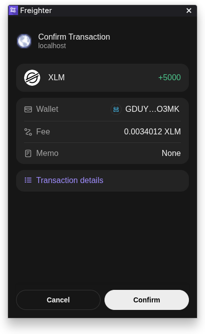
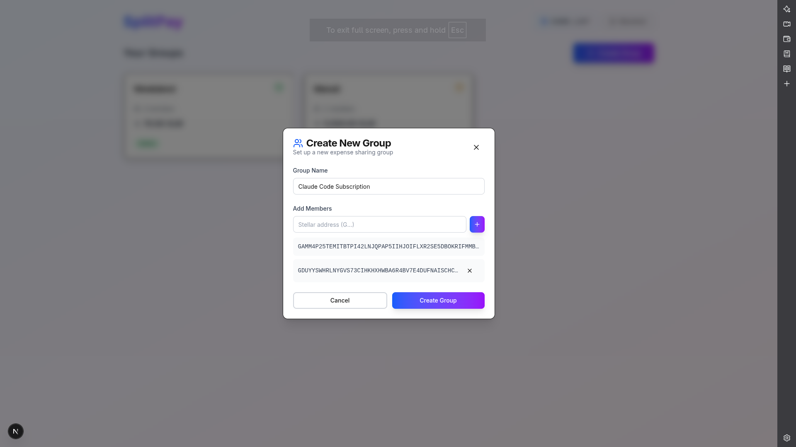
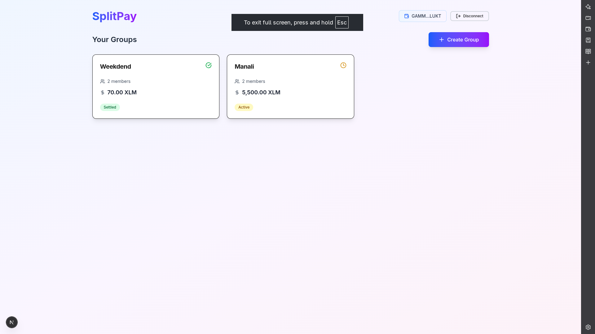
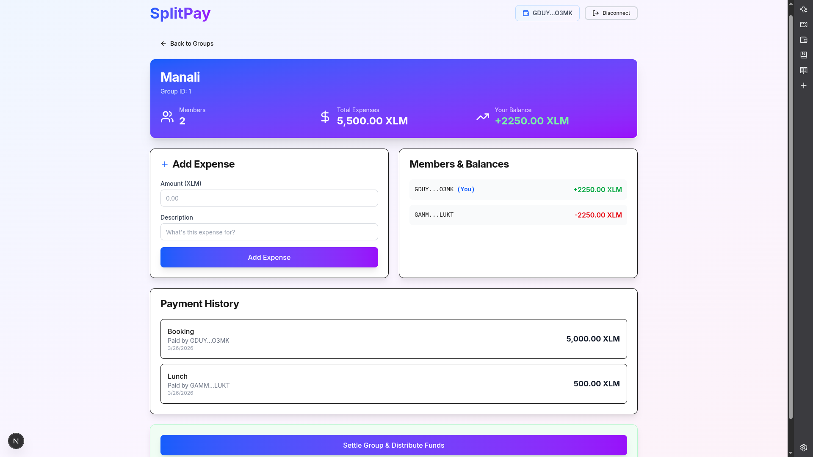
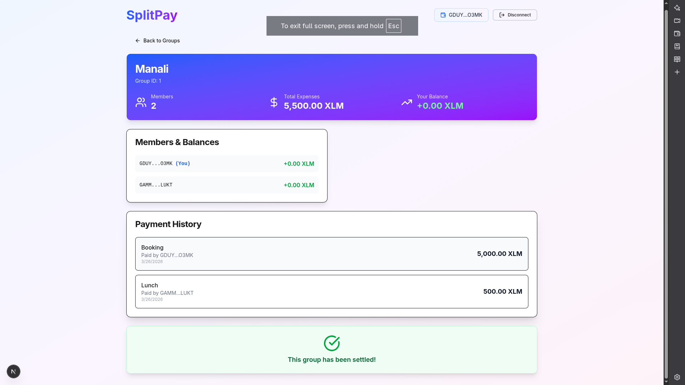

# SplitPay 💸

SplitPay is a high-performance, decentralized expense-sharing platform built on the Stellar network using Soroban smart contracts. It enables groups to track shared expenses, compute fair settlements, and distribute funds on-chain with zero friction.

---

## 🌟 Project Vision

Our vision is to revolutionize group financial management by replacing trust with transparency. By leveraging the speed and security of Stellar Soroban, SplitPay ensures that group settlements are always fair, verifiable, and instant.

---

## 🚀 Key Features

- **Premium Real-Time Dashboard**  
  Glassmorphism-based UI for managing group expenses.

- **Freighter Wallet Integration**  
  Seamless connection and transaction signing.

- **Smart Contract Consensus**  
  All operations recorded on Stellar Testnet via Soroban.

- **Automated Rebalancing**  
  Automatically calculates balances and simplifies settlements.

- **Responsive Design**  
  Works across desktop and mobile devices.

---

## 📜 Smart Contract Details

SplitPay is deployed on the Stellar Testnet.

- **Contract ID**  
  `CDVJA6VO3AK7EOZXZ7QKXZUAEEJMNYPR35NZC4B3BGK55AUTQHWSZSMR`

- **Token Contract**  
  `CDLZFC3SYJYDZT7K67VZ75HPJVIEUVNIXF47ZG2FB2RMQQVU2HHGCYSC`

- **Block Explorer**  
  https://stellar.expert/explorer/testnet/contract/CDVJA6VO3AK7EOZXZ7QKXZUAEEJMNYPR35NZC4B3BGK55AUTQHWSZSMR

---

## 🖼️ Product Walkthrough

### 🔐 Wallet Connection


### ➕ Create Group


### 📊 Dashboard Overview


### 💸 Expense Tracking


### ✅ Settlement Flow


---

## 💻 Project Setup

### 1. Prerequisites

- Node.js (v18+)
- Stellar Testnet Account (funded with XLM)
- Freighter Wallet Extension

---

### 2. Environment Setup

Create a `.env.local` file inside `frontend/`:

```env
NEXT_PUBLIC_CONTRACT_ID=CDVJA6VO3AK7EOZXZ7QKXZUAEEJMNYPR35NZC4B3BGK55AUTQHWSZSMR
NEXT_PUBLIC_TOKEN_ID=CDLZFC3SYJYDZT7K67VZ75HPJVIEUVNIXF47ZG2FB2RMQQVU2HHGCYSC
NEXT_PUBLIC_NETWORK=testnet
NEXT_PUBLIC_HORIZON_URL=https://horizon-testnet.stellar.org
NEXT_PUBLIC_SOROBAN_URL=https://soroban-testnet.stellar.org
